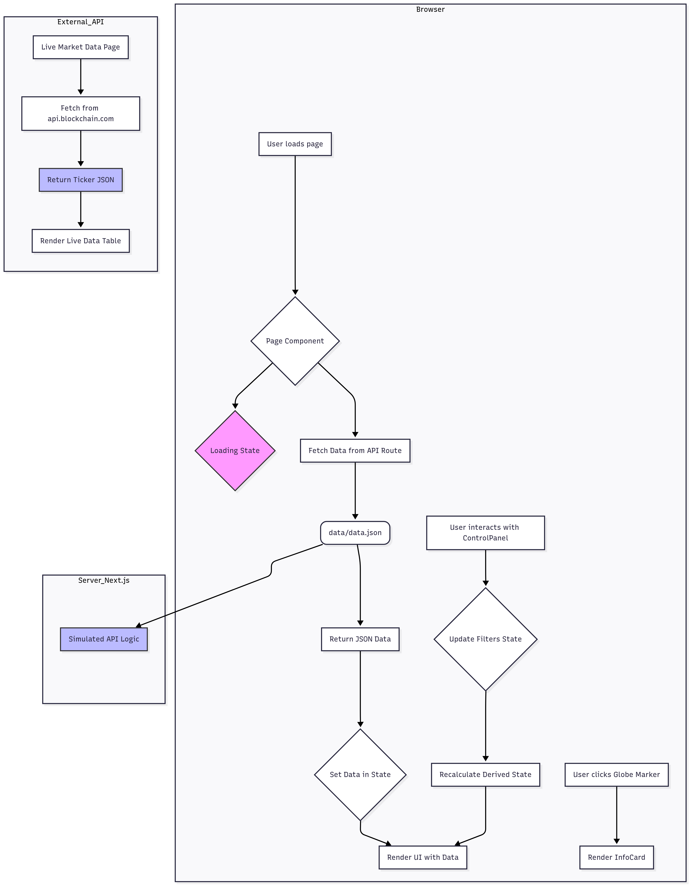

# Latency Visualizer: In-Depth Project Documentation

## 1. Objective

To create a specialized Next.js application that displays an interactive 3D world map. The primary purpose is to visualize the global server locations of major cryptocurrency exchanges and to display real-time or historical latency data across key AWS, GCP, and Azure co-location regions. This tool is designed to provide insights into the infrastructure powering cryptocurrency trading.

---

## 2. The Solution

Latency Visualizer provides a rich, interactive, and data-driven visualization of the world's cryptocurrency exchange infrastructure. The application presents users with a 3D globe that they can rotate, zoom, and inspect. On this globe, we plot the server locations of major exchanges and the data centers of top cloud providers.

The core of the application is its ability to make complex geographical and network data intuitive. By using distinct visual markers, colors, and animated connection lines, users can instantly understand the relationships between different data points. An interactive control panel allows for real-time filtering and exploration of the data, while separate pages for tabular data and live market information offer different perspectives on the crypto landscape.

### Key Features:

- **Interactive 3D Globe**: A smooth, high-performance 3D globe serves as the main canvas for visualization.
- **Server & Region Plotting**: Accurately plots the locations of exchange servers and cloud provider data centers.
- **Latency Visualization**: Animated, color-coded connection lines between servers provide an at-a-glance understanding of network performance.
- **Dynamic Filtering**: A comprehensive control panel allows users to filter data by exchange, cloud provider, latency range, and to toggle different visual layers.
- **Detailed Information Pop-ups**: Clicking on any server or region brings up a card with detailed information.
- **Tabular Data View**: A separate page presents all the server latency data in a sortable, easy-to-read table.
- **Live Market Data**: A dedicated page fetches and displays real-time cryptocurrency ticker data from a live third-party API.
- **Responsive Design**: The entire application is optimized for a seamless experience on both desktop and mobile devices.

---

## 3. Visual Representation Guide

The 3D map uses specific colors and shapes to convey information clearly.

| Element             | Representation                                                                                              | Color Scheme                                                                                                                                                                                                                                                                                             |
| ------------------- | ----------------------------------------------------------------------------------------------------------- | -------------------------------------------------------------------------------------------------------------------------------------------------------------------------------------------------------------------------------------------------------------------------------------------------------- |
| **Exchange Server** | A small sphere marker at the server's geographical location.                                                | Color-coded by the cloud provider: <br/>- <span style="color:#FF9900">■</span> **AWS**: Orange <br/>- <span style="color:#4285F4">■</span> **GCP**: Blue <br/>- <span style="color:#0078D4">■</span> **Azure**: Dark Blue <br/>- <span style="color:#9E9E9E">■</span> **Other**: Gray                    |
| **Cloud Region**    | A torus (donut) shape indicating the location of a major cloud data center region.                          | Same as the server color scheme to maintain consistency.                                                                                                                                                                                                                                                 |
| **Connection Line** | An animated, dashed line arcing between two exchange servers. The animation indicates an active connection. | Color-coded by the average latency of the two connected servers: <br/>- <span style="color:#2E8B57">■</span> **Low Latency (<50ms)**: Green <br/>- <span style="color:#FFD700">■</span> **Medium Latency (50-100ms)**: Yellow <br/>- <span style="color:#DC143C">■</span> **High Latency (>100ms)**: Red |

---

## 4. Technology Stack

The application is built on a modern, robust, and performant tech stack, chosen specifically to handle the demands of 3D rendering and data visualization within a web environment.

| Technology             | Role & Justification                                                                                                                                                                   |
| ---------------------- | -------------------------------------------------------------------------------------------------------------------------------------------------------------------------------------- |
| **Next.js**            | As the core framework, Next.js provides server-side rendering, API routes, and a file-based routing system (App Router) that keeps the project organized and scalable.                 |
| **React**              | Used for building the component-based user interface, allowing for a modular and maintainable codebase.                                                                                |
| **TypeScript**         | Ensures type safety, which significantly reduces bugs, improves code quality, and makes the application easier to refactor and maintain.                                               |
| **Three.js**           | The powerhouse behind the 3D visualization. It's used to render the globe, starfield, server markers, and the animated connection lines, offering fine-grained control over the scene. |
| **ShadCN UI**          | Provides a library of beautifully designed, accessible, and unstyled components (like Cards, Sliders, and Switches) that serve as the building blocks for our custom UI.               |
| **Tailwind CSS**       | A utility-first CSS framework used for all styling. It allows for rapid and consistent UI development directly within the component files.                                             |
| **Lucide React**       | Provides a clean and consistent set of icons used throughout the user interface to improve usability and visual appeal.                                                                |
| **Blockchain.com API** | A third-party API used on the "Live Market Data" page to fetch and display real-time cryptocurrency ticker information, demonstrating live API integration.                            |

---

## 5. Application & Data Flow

The application follows a standard Next.js data flow pattern, separating the UI from the data fetching logic.

1.  **Initial Load**: When a user visits a page, the corresponding React component fetches data from a Next.js API route (e.g., `/data/data.json`).
2.  **API Route**: The API route acts as a backend, fetching data from a source (currently simulated, but could be a database or external API) and returning it as JSON.
3.  **State Management**: The fetched data is stored in the component's state. A loading state is shown to the user while the data is being fetched.
4.  **Rendering**: Once the data is available, the component renders the main UI, passing data down to child components like `MapContainer` or the data tables.
5.  **User Interaction**: When the user interacts with filters in the `ControlPanel`, the state is updated, which triggers a re-render of the `MapContainer` with the filtered data. This happens client-side for immediate feedback.
6.  **External API**: For the "Live Market Data" page, the component fetches directly from the external `api.blockchain.com` endpoint to get real-time information.

---

## 6. Code Documentation & Project Structure

The project is organized logically to separate concerns, making it easy to navigate and understand.

```
/
├── public/                 # Static assets (images, textures for the globe)
├── src/
│   ├── app/                # Next.js App Router pages and layouts
│   │   ├── page.tsx        # The main page for the 3D globe visualization.
│   │   └── layout.tsx
│   │   └── globals.css
│   │
│   ├── components/
│   │   ├───├
│   │   │   ├── map-container.tsx       # The core component that renders the 3D globe.
│   │   │   ├── control-panel.tsx       # The interactive filtering and controls panel.
│   │   │   └── header.tsx              # The main application header.
│   │   │   └── LatencyTable.tsx        # The page for the tabular server latency view.
│   │   │   └── liveMarketData.tsx      # The page for the live crypto ticker data.
│   │   │   └── MarketDashboard.tsx     # This component is for switching the Tabs
│   │   └── ui/                         # Reusable UI components from ShadCN.
│   │
│   ├── hooks/
│   │   └── use-mobile.tsx  # A custom hook to detect mobile screen sizes.
│   │
│   ├── lib/
│   │   ├── three-utils.ts  # Utility functions for Three.js (e.g., coordinate conversion).
│   │   └── utils.ts        # General utility functions (e.g., `cn` for classnames).
│   │
│   └── types/
│       └── geo.ts          # TypeScript type definitions for our geographical data.
│
├── PROJECT_DOCUMENTATION.md      # This file.
├── README.md                     # The main README file with quick-start instructions.
```

### Core Component Deep Dive

- **`map-container.tsx`**: This is the heart of the visualization.

  - It uses `three.js` to set up a `Scene`, `Camera`, and `Renderer`.
  - It creates the Earth globe using a `SphereGeometry` and maps a texture to it.
  - It renders server markers (`Mesh`) at specific latitude/longitude points by converting them to 3D vectors using `latLonToVector3`.
  - It draws the animated, color-coded connection lines (`Line`) between servers using a `QuadraticBezierCurve3` to create a smooth arc over the globe's surface.
  - It handles user interactions like mouse movement (for hover effects) and clicks (to select items) using a `Raycaster`.

- **`control-panel.tsx`**: This component provides the UI for filtering the data.

  - It receives the current `filters` state and an `onFiltersChange` callback function from its parent.
  - It uses ShadCN components like `Input`, `Select`, `Slider`, and `Switch` to build the interactive form.
  - When a user changes a filter, it calls `onFiltersChange` with the new state, which triggers a re-render of the `MapContainer` with the filtered data.

- **`app/page.tsx` (Main Page)**: This is the main container component that manages the application's state.
  - It fetches the initial `geoData` from the `/data/data.json` route.
  - It uses the `useState` hook to hold the current `filters`.
  - It uses the `useMemo` hook to efficiently re-calculate the `filteredGeoData` whenever the `filters` state changes. This prevents unnecessary re-computation and ensures optimal performance.
  - It passes the filtered data down to the `MapContainer` and the filter state to the `ControlPanel`.

---

## 7. Local Development

Follow these instructions to get the project running on your local machine for development and testing purposes.



### Prerequisites

- Node.js (v18 or later recommended)
- npm (or a compatible package manager like yarn or pnpm)

### Setup Instructions

1.  **Clone the Repository**:

    ```bash
    git clone https://github.com/Sujal942/Latency-Topology-Visualizer.git
    cd <repository-directory>
    ```

2.  **Install Dependencies**:
    This command will install all the necessary packages defined in `package.json`.

    ```bash
    npm install
    ```

3.  **Run the Development Server**:
    This command starts the Next.js development server, typically on port 3000.

    ```bash
    npm run dev
    ```

4.  **View the Application**:
    Open your web browser and navigate to [http://localhost:3000](http://localhost:3000) to see the application running.
